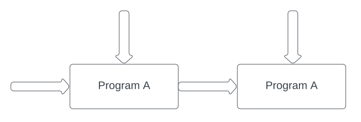
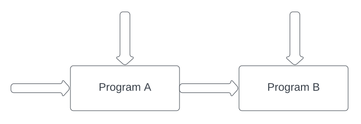

# Chaining

Chaining is an essential feature when moving from toy applications to real life; maybe we'd like to update an ML model based on new training data that came in or maybe we'd like to compose smart contracts together. Regardless of the particular application, we need some way to use the encrypted output of one FHE program as an input to another FHE program.

We have yet to see another FHE compiler support this feature so we'll briefly explain the different chaining scenarios.

## Chaining with the same program


Let's look at a special case of chaining where we want to use the encrypted output of Program A as one of the inputs to a new run of Program A.

We'll consider a very simple application so we can focus on how to use this feature. Suppose we have a private account balance that we periodically need to update with incoming private transactions. We express this with the following FHE program:

```rust
# use sunscreen::{fhe_program, types::{Cipher, bfv::Signed}};

#[fhe_program(scheme = "bfv")]
fn accumulate_balance(balance: Cipher<Signed>, tx_amount: Cipher<Signed>) -> Cipher<Signed> {
    balance + tx_amount
}
```

When we compile the above FHE program, the compiler chooses scheme parameters that guarantee we can run it with freshly encrypted[^1] ciphertexts. As written, the compiler guarantees nothing if the ciphertexts *aren't* "fresh." As we'll see below, with one simple change to the code, we can chain executions together and fix this limitation.

```rust
# use sunscreen::{fhe_program, types::{Cipher, bfv::Signed}};

#[fhe_program(scheme = "bfv", chain_count = 10)]
fn accumulate_balance(balance: Cipher<Signed>, tx_amount: Cipher<Signed>) -> Cipher<Signed> {
    balance + tx_amount
}
```

`chain_count = 10` tells the compiler to choose FHE scheme parameters that allow us to chain the program up to 10 times. That is, we can use `accumulate_balance`'s returned ciphertext as the input to another run of `accumulate_balance` and we can repeat this process up to 10 times. After the final run, the resulting ciphertext can still be decrypted successfully.

## Chaining with different programs (stay tuned!)


More generally, we may want to use the encrypted output of one FHE program as the input to a *different* FHE program.

As this feature is currently in progress, attempting to compile more than one FHE program with any of them declaring a `chain_count` will result in a compilation error.

[^1]: A freshly encrypted ciphertext is one that results directly from encryption; in contrast, a non-fresh ciphertext is one resulting from an FHE program and thus has more noise.
