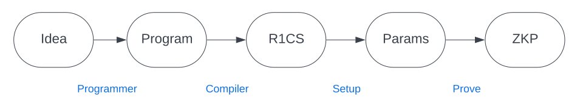

# A light introduction to ZKPs

In a zero knowledge proof (ZKP), we have two parties&mdash;a prover and a verifier. The prover is trying to convince the verifier of some fact without revealing to the verifier why it's true. 

In the introduction, we mentioned that a simple real world example might involve Alice trying to convince Bob the bartender she's over 21 without revealing exactly how old she is (she's 27). In the language of ZKPs, Alice would be the "prover" and Bob would be the "verifier." The statement Alice is trying to show she satisfies is that she is over 21 and her "witness" (think of this as a private piece of information that the prover Alice will use to show she satisfies the statement) might be her ID stating she is 27. Alice will keep the witness hidden from Bob.

## How a ZKP works
There are a few steps in an (interactive) ZKP. Don't worry too much about technical details here&mdash;we just want to give you a feel for how ZKPs work at a high level.[^1]

1. The prover first creates a *commitment* (this will prevent her from cheating later on) which she sends to the verifier. 

2. The verifier then sends a *challenge* to the prover to test her knowledge of what she has claimed.

3. The prover sends a *response* to the verifier's challenge (which the verifier will check). You can think of the response as the "proof".

[^1]: What follows is a description of a *Sigma protocol*.

## ZKP properties

The three properties a ZKP must satify are completeness, soundness, and zero-knowledge.

- **Completeness**: if the statement is true, the verifier will be _convinced_ by the proof.
- **Soundness**: if the statement is false, the prover _cannot cheat_ (i.e. convince the verifier to accept the proof) except with some tiny, tiny probability.
- **Zero-knowledge**: the verifier _learns nothing_ other than the fact that the statement is true.

For most applications, we'd like our proof to be **non-interactive**. Rather than having a back and forth interaction between the prover and verifier, wouldn't it be nice if we could reduce the protocol to a single round? This can be done using the [Fiat-Shamir transformation](https://en.wikipedia.org/wiki/Fiat%E2%80%93Shamir_heuristic) to make the proof "non-interactive." 

In modern day applications of ZKPs, we'd generally like our proof to be **succinct** as well. There's some debate around what exactly succinct means but generally we'd like for the proof size to be logarithmic (ideally constant) in the size of the computation.

## Why do we need a ZKP compiler?

While all of the above sounds simple enough (hopefully), how do we actually start translating programs (written in some higher level programming language) into ZKPs?

Let's look at an overview of the process.[^2]

1. "Idea" : The developer has an idea for an application or program he wants to create that requires proving some relations over private data.
2. "Program" : The developer translates his application idea into a program (potentially written in some high level programming language like Python or Rust).
3. "R1CS" : The developer needs to translate his program into a format that can be used in a ZKP. This requires thinking about the program&mdash;specifically the parts involving the relations over private data&mdash;in terms of circuits and constraints (conditions we want to impose on our inputs) instead. As part of this, the developer will need to choose a particular [arithmetization](https://blog.lambdaclass.com/arithmetization-schemes-for-zk-snarks/) scheme (such as R1CS).
4. "Params" : Once the developer has translated the relevant part of his program into circuits and constraints, he can feed that into the setup process of a ZKP to generate parameters needed in the proving and verifying algorithms.
5. "ZKP" : Finally, the developer has a ZKP ready to go that others can interact with.

So where does a compiler comes in?

Well, it helps automate the process of translating your program into a format that can then be used in a ZKP (setting up the circuits and constraints for you behind the scenes according to the chosen arithmetization!). The developer will write his program in a high level programming language, letting the compiler know what info he wants to be public vs. private and specifying constraints in a high level way (expressing what relations need to be satisfied on the inputs in terms of `=`, `>`, `<`, `>=`, `<=`).

In the future, you'll be able to use Sunscreen's FHE and ZKP compilers in conjunction, adding the `#[fhe_program(...)]` and `#[zkp_program]` attributes as needed to various parts of your code to let the compiler know which parts of your code you'd like transformed.

[^2]: Image and explanation adapted from Berkeley's ZKP MOOC, [lecture 3](https://zk-learning.org/assets/lecture3-2023.pdf). 

## Further reading
If you'd like to learn more about how ZKPs work, we recommend the following resources:
- [Vitalik's blog post](https://medium.com/@VitalikButerin/quadratic-arithmetic-programs-from-zero-to-hero-f6d558cea649) on zkSNARKs
- [ZK Whiteboard sessions](https://www.youtube.com/playlist?list=PLj80z0cJm8QErn3akRcqvxUsyXWC81OGq), particularly the first 3 videos
- [Berkeley's ZKP MOOC](https://rdi.berkeley.edu/zkp-course/s23), particularly the first 3 videos

